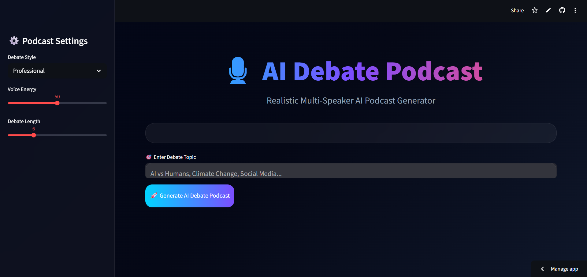

# 🎙️ AI Debate Podcast Generator

A futuristic AI-powered multi-speaker podcast system that generates realistic debates using LLMs, emotional AI voices, and Retrieval-Augmented Generation (RAG).

The application creates complete podcast-style debates with:
- 🎤 Host moderation
- 🧠 AI-generated arguments
- 🎧 Multi-speaker emotional voices
- 📚 Knowledge retrieval using ChromaDB
- 🌐 Modern Streamlit interface
- ⬇️ Downloadable podcast audio

---

# 🚀 Features

## 🎙️ AI Podcast Debate Generation

Generate complete AI podcast episodes automatically.

Each generated podcast includes:
- Host introduction
- Multi-speaker debate
- Counter arguments
- Emotional interactions
- Realistic conversation flow
- Podcast ending

---

# 🧠 LLM Powered Debate Engine

Uses **Groq LLM** for ultra-fast debate generation.

### Capabilities
✅ Realistic human-like debates  
✅ Logical argument generation  
✅ Context-aware responses  
✅ Dynamic conversation flow  
✅ Topic understanding  
✅ Multi-turn discussion  

---

# 📚 RAG (Retrieval-Augmented Generation)

The project supports external knowledge retrieval using:
- ChromaDB
- LangChain
- Sentence Transformers

### How It Works

If topic-related documents exist:
✅ AI retrieves relevant context from PDFs

If documents do not exist:
✅ AI still generates debate using LLM knowledge

---

# 🎧 Emotional AI Voices

Uses Microsoft Edge-TTS for realistic speech synthesis.

### Features
✅ Different voices for each speaker  
✅ Emotional speech modulation  
✅ Natural pacing  
✅ Humanized pauses  
✅ Pitch and speed variation  
✅ More realistic debate conversations  

---

# 🎤 Speaker System

The generated podcast contains:

| Speaker | Role |
|---|---|
| Host | Moderator |
| Alex | Speaker 1 |
| Jamie | Speaker 2 |

---

# 🌐 Modern Streamlit Frontend

### UI Features
✅ Dark futuristic theme  
✅ Glassmorphism UI  
✅ Responsive layout  
✅ Podcast transcript viewer  
✅ Audio player  
✅ Download podcast button  
✅ Sidebar controls  

---

# 🏗️ Project Structure

```text
Ai_Debate_Podcast/
│
├── debate/
│   ├── generator.py
│   ├── parser.py
│   └── prompts.py
│
├── rag/
│   ├── ingest.py
│   └── retrieve.py
│
├── utils/
│   ├── emotion.py
│   └── text_cleaner.py
│
├── data/
│   └── PDF files
│
├── streamlit_app.py
├── voice_generator.py
├── mixer.py
├── requirements.txt
├── packages.txt
└── README.md
```

---

# ⚙️ Technologies Used

| Technology | Purpose |
|---|---|
| Streamlit | Frontend UI |
| Groq | LLM |
| ChromaDB | Vector Database |
| LangChain | RAG Pipeline |
| Sentence Transformers | Embeddings |
| Edge-TTS | AI Voice Generation |
| FFmpeg | Audio Processing |

---

# ⚙️ Installation

---

# 1️⃣ Clone Repository

```bash
git clone https://github.com/YOUR_USERNAME/Ai_Debate_Podcast.git

cd Ai_Debate_Podcast
```

---

# 2️⃣ Create Virtual Environment

## Windows

```bash
python -m venv venv
```

Activate environment:

```bash
venv\Scripts\activate
```

---

# 3️⃣ Install Requirements

```bash
pip install -r requirements.txt
```

---

# 🔑 Setup GROQ API Key

Create a `.env` file in the root folder:

```env
GROQ_API_KEY=your_api_key_here
```

---

# 📚 Setup Knowledge Base

Place your PDF files inside:

```text
data/
```

Examples:
- Research papers
- AI articles
- Climate reports
- Education documents
- Social media studies

---

# 🧠 Create Vector Database

Run:

```bash
python rag/ingest.py
```

This converts PDFs into embeddings and stores them inside ChromaDB.

---

# ▶️ Run Application

```bash
streamlit run streamlit_app.py
```

---

# 🌐 Streamlit Cloud Deployment

---

# Required Files

## requirements.txt

Example:

```text
streamlit
groq
edge-tts
chromadb
langchain
langchain-community
sentence-transformers
pypdf
python-dotenv
```

---

## packages.txt

```text
ffmpeg
```

---

# 🔐 Streamlit Secrets

Inside Streamlit Cloud:

## App Settings → Secrets

Add:

```toml
GROQ_API_KEY="your_api_key"
```

---

# 🎧 Example Workflow

---

# User Input

```text
Should AI replace teachers?
```

---

# System Pipeline

## 1️⃣ Retrieve Context

RAG searches ChromaDB for relevant document chunks.

---

## 2️⃣ Generate Debate

Groq LLM generates:
- Host introduction
- Speaker arguments
- Counter points
- Debate conclusion

---

## 3️⃣ Generate Voices

Each speaker gets:
- unique AI voice
- emotional speech
- realistic pacing

---

## 4️⃣ Merge Audio

All generated clips are merged into:

```text
final_podcast.mp3
```

---

# 🧠 Emotional Voice System

### Voice Mapping

| Speaker | Voice |
|---|---|
| Host | AriaNeural |
| Alex | GuyNeural |
| Jamie | JennyNeural |

---

# 🎵 Audio Features

✅ Emotional speech  
✅ Humanized pauses  
✅ Speed variation  
✅ Pitch variation  
✅ Speaker personality differences  

---

# 📸 Screenshots

Add screenshots inside:

```text
screenshots/
```

Then include:

```markdown

```

---

# 🛠️ Troubleshooting

---

# FFmpeg Error

Add inside `packages.txt`:

```text
ffmpeg
```

---

# ChromaDB Not Working

Rebuild database:

```bash
python rag/ingest.py
```

---

# Voice Generation Issues

Delete old audio files:

```text
audio_*.mp3
final_podcast.mp3
```

and regenerate.

---

# Streamlit Deployment Errors

Check:
- requirements.txt
- packages.txt
- Streamlit secrets
- GROQ API key
- ffmpeg installation

---

# 📈 Future Improvements

Planned upgrades:

- 🎥 AI video podcasts
- 👤 Animated avatars
- 🌍 Multilingual debates
- 🎼 Background music
- 🎚️ Voice cloning
- 📡 Live AI conversations
- 📱 Mobile optimization

---

# 🤝 Contributing

Contributions are welcome.

## Steps

1. Fork repository
2. Create feature branch
3. Commit changes
4. Push branch
5. Open Pull Request

---

# 👨‍💻 Author

Developed by **Ritu Patel**


